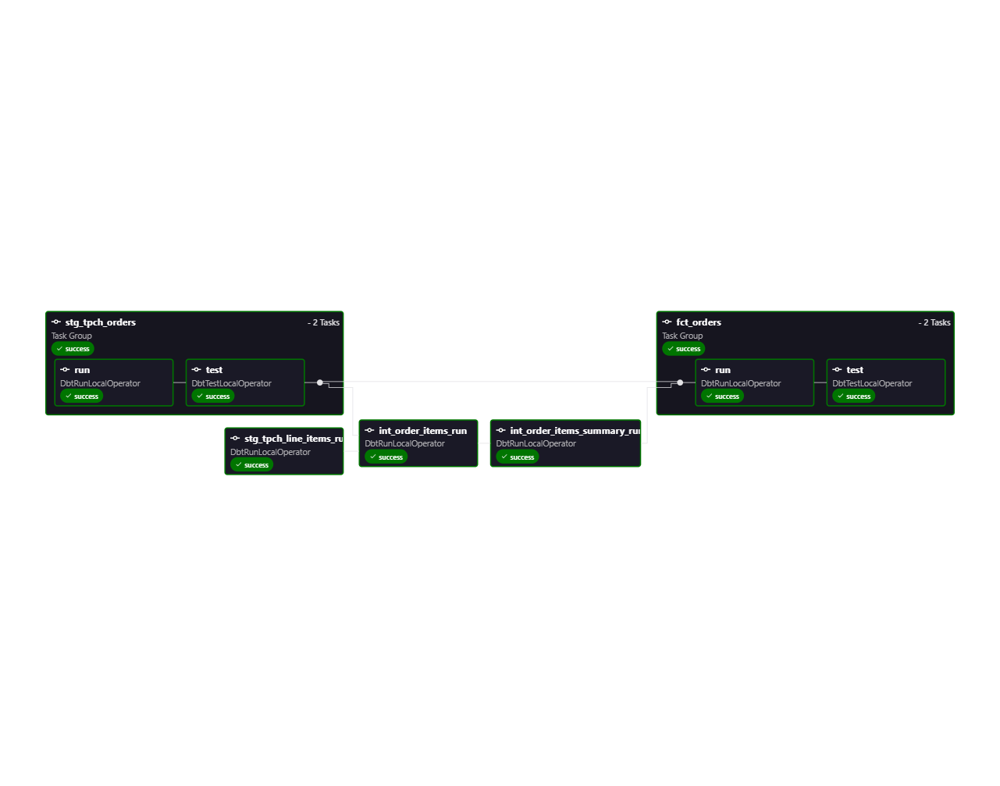
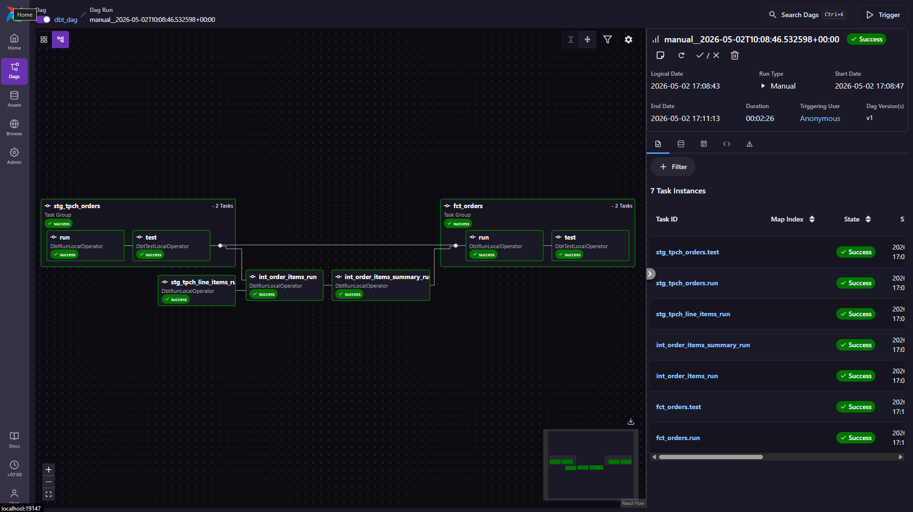

# **ELT-Pipeline-Workflow**

A proof-of-concept ELT (Extract, Load, Transform) pipeline demonstrating the power of the Modern Data Stack. This project orchestrates data transformations inside a Cloud Data Warehouse (Snowflake) using **dbt (data build tool)**, fully automated and monitored by **Apache Airflow**.

## The Architecture (Why ELT? well i'm just curious actually)
Unlike traditional ETL where the transformation happens in a middle-tier server (which is resource-heavy), this pipeline utilizes the **ELT paradigm**:
1. **Extract & Load:** Raw TPCH dataset is loaded directly into Snowflake.
2. **Transform (Push-Down Compute):** Airflow orchestrates dbt to send SQL execution plans directly to Snowflake. The heavy lifting is done by Snowflake's massive compute clusters, not the local machine.

## 📸 Pipeline Visualization

### Airflow DAG: Task Execution Graph

### Airflow UI: Successful Execution

## Transformation Workflow (dbt Models)
The pipeline strictly follows analytical engineering best practices by breaking down the SQL transformations into modular stages:

1. **Staging Layer (`stg_tpch_orders`, `stg_tpch_line_items`)**
   - Cleans and standardizes raw data directly from the Snowflake source.
   - *Automated Testing:* Executes `DbtTestLocalOperator` immediately after running to ensure data integrity (e.g., checking for nulls or unique primary keys).
2. **Intermediate Layer (`int_order_items_run`, `int_order_items_summary_run`)**
   - Joins staging tables and performs initial granular aggregations.
3. **Fact Layer (`fct_orders`)**
   - The final, business-ready dimensional model.
   - *Automated Testing:* A final round of data quality checks before the table is exposed to BI Dashboards.

## Key Takeaways & Technical Hurdles Overcome
- **Cross-Platform Adaptation:** Successfully adapted a macOS-centric ELT workflow to run seamlessly on a Windows (WSL2/Docker) environment without breaking dependency paths.
- **Data Quality Orchestration:** Integrated `dbt test` natively within the Airflow DAG using Task Groups to halt the pipeline if data anomalies are detected.
- **Resource Efficiency:** By pushing the compute down to Snowflake, the local orchestrator (Airflow) utilizes minimal RAM, proving that heavy data workloads can be managed efficiently on standard consumer hardware.

---
*Built for learning, ready for scaling. azeeekkk*
